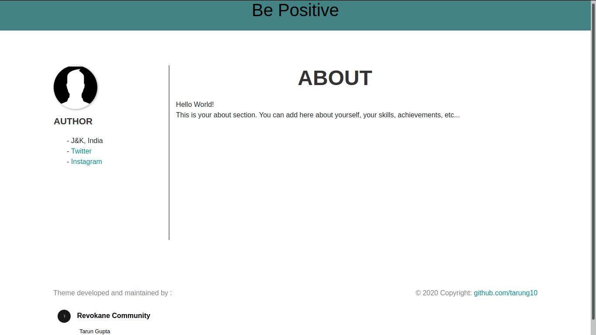

# Portfolio
## Attractive and responsive template
### Maintained by @tarung10

 
Installation:
   * git clone https://github.com/tarung10/portfolio.git
   
Usage:
   1. Replace your picture with author.png in img directory.
   2. Update index.html
   
## Enjoy Portfolio :)
